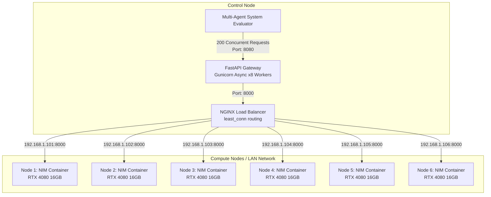

# Distributed NVIDIA NIM Cluster Guide (College Network)

This guide explains how to connect 6 individual systems (each with an RTX 4080 16GB GPU) to serve high-concurrency requests for a multi-agent system evaluation. 

## 1. Architecture Diagram

The architecture follows a **Hub-and-Spoke** model. One machine acts as the 'Control Node' (Master), and all 6 machines act as 'Compute Nodes' (Workers). The master machine can also double as a Compute Node if needed.



### How it Works:
1. **Client (Your Multi-Agent System)** sends parallel requests to the FastAPI Gateway on the Control Node.
2. The **FastAPI Gateway** catches these requests asynchronously, ensuring no connections drop while waiting, and forwards them to NGINX.
3. NGINX acts as a **Reverse Proxy & Load Balancer**. Because we use `least_conn;` routing, NGINX constantly monitors the 6 RTX 4080 nodes. Whenever a new API request comes in, NGINX instantly routes it to the machine currently processing the fewest active streams.
4. **NVIDIA NIM Compute Nodes** run securely in Docker, accepting these requests, batching them via Triton/TensorRT-LLM (built into NIM), and returning tokens via SSE (Server Sent Events) back through NGINX to your gateway.

---

## 2. Step-by-Step Setup

### Step 2.1: Prepare the College Network (LAN)
All 6 systems MUST be on the same Local Area Network (LAN). 
1. Obtain the Local IP Address of each of the 6 systems (e.g., `192.168.1.101` through `192.168.1.106`).
2. Ensure firewall rules on all 6 machines allow incoming TCP traffic on port `8000`.

### Step 2.2: Launch NIM on ALL 6 Worker Nodes 
On **every single one of the 6 systems**, run the following script to pull and start the model. 
*(Note: Because RTX 4080 has 16GB VRAM, NVIDIA NIM will automatically leverage quantized engines/optimizations if the model requires it to fit within 16GB).*

Run this directly in the terminal of all 6 machines:

```bash
docker login nvcr.io
# Provide username: $oauthtoken and password: <YOUR_NGC_API_KEY>

export LOCAL_NIM_CACHE=~/.cache/nim
mkdir -p "$LOCAL_NIM_CACHE"
chmod -R a+w "$LOCAL_NIM_CACHE"

docker run -d --rm \
    --name "nim-inference-node" \
    --gpus all \
    --ipc host \
    --shm-size=16GB \
    -e NGC_API_KEY="<YOUR_NGC_API_KEY>" \
    -v "$LOCAL_NIM_CACHE:/opt/nim/.cache" \
    -p 8000:8000 \
    nvcr.io/nim/moonshotai/kimi-k2.5:latest
```

### Step 2.3: Configure the Control Node (Master)
Pick ONE machine to be the master (it can be Node 1). 
Edit your `nim_app/nginx/nginx.conf` file. Replace the `127.0.0.1` IPs with the actual LAN IPs of your 6 systems.

```nginx
    upstream nim_inference_nodes {
        least_conn; # CRITICAL for multi-agent efficiency
        
        server 192.168.1.101:8000 max_fails=3 fail_timeout=30s;
        server 192.168.1.102:8000 max_fails=3 fail_timeout=30s;
        server 192.168.1.103:8000 max_fails=3 fail_timeout=30s;
        server 192.168.1.104:8000 max_fails=3 fail_timeout=30s;
        server 192.168.1.105:8000 max_fails=3 fail_timeout=30s;
        server 192.168.1.106:8000 max_fails=3 fail_timeout=30s;
        
        keepalive 64; # Keep persistent TCP connections to workers
    }
```

### Step 2.4: Launch Gateway on the Control Node
On your designated master machine, run the deploy script we created earlier:

```bash
cd nim_app
chmod +x deploy_gateway.sh
./deploy_gateway.sh
```

Now, your multi-agent system can point entirely to `http://<MASTER_NODE_IP>:8080/v1/chat/completions` and the load will seamlessly distribute across all 6 physical GPUs!

---

## 3. Efficient Resource Management (The 16GB Challenge)

Running heavy concurrency on an RTX 4080 limit of 16GB VRAM requires careful attention. NGINX + FastAPI handles the connection layer smoothly, but GPU VRAM restricts the execution layer.

1. **Continuous Batching (Inflight Batching):** NVIDIA NIM utilizes Triton Inference Server internally. When 33 agents send requests at the same time to a single 4080 (200 requests / 6 nodes ≈ 33 reqs/node), NIM will dynamically batch these operations on the GPU layer. 
2. **Context Window Limits:** With only 16GB VRAM, the KV Cache (memory used to store context for active requests) will run out fast if handling 33 concurrent requests with long prompts. 
    * **Actionable Advice:** Keep your multi-agent system prompts concise. If prompts are highly repetitive (e.g., standard sys-prompts), NIM's prompt caching mechanisms will help share the KV cache automatically between agents, saving enormous amounts of VRAM.
3. **Queueing:** If a Node runs out of VRAM/Compute capacity, NGINX's `least_conn` strategy will realize that node is slowing down (fewer resolved connections) and will prioritize routing to the other 5 nodes automatically, ensuring no single 4080 is perfectly deadlocked.